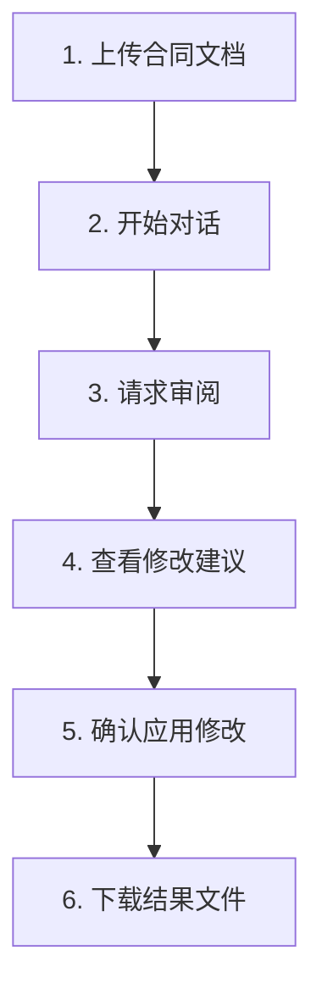

# 合同审阅系统 API 接口文档

## 📋 概述

这是一个基于FastAPI的合同审阅系统API，为前端提供以下核心功能：
- 📄 合同文档上传
- 🤖 智能对话和审阅
- ✏️ 自动修改建议
- 📥 文档和报告下载


- **服务地址**: `http://localhost:8000`
- **API文档**: `http://localhost:8000/docs` (Swagger UI)
- **健康检查**: `http://localhost:8000/api/health`

## 🔧 环境要求

- MCP服务器运行在 `http://127.0.0.1:8081/mcp/`
- 环境变量 `DEEPSEEK_API_KEY` 已设置
- 支持的文件格式：`.docx`

## 📡 API 端点

### 1. 🏥 健康检查
**GET** `/api/health`

检查服务是否正常运行。

**响应示例:**
```json
{
  "status": "healthy",
  "timestamp": "2024-01-01T12:00:00"
}
```

---

### 2. 📄 上传合同文档
**POST** `/api/upload`

上传合同文档文件，开始新的审阅会话。

**请求参数:**
- `file` (File, 必需): 合同文档文件 (.docx格式)
- `session_id` (String, 可选): 会话ID，不提供会自动生成

**响应示例:**
```json
{
  "success": true,
  "message": "文件上传成功",
  "session_id": "550e8400-e29b-41d4-a716-446655440000",
  "document_id": "550e8400-e29b-41d4-a716-446655440000_contract.docx"
}
```

---

### 3. 💬 与助手对话
**POST** `/api/chat`

与AI助手进行对话，支持审阅、修改等操作。

**请求体:**
```json
{
  "message": "请帮我审阅这份合同",
  "session_id": "550e8400-e29b-41d4-a716-446655440000",
  "action": "chat"
}
```

**参数说明:**
- `message` (String, 必需): 用户消息
- `session_id` (String, 必需): 会话ID
- `action` (String, 可选): 操作类型 (`chat`, `review`, `modify`, `export`)

**响应示例:**
```json
{
  "response": "✅ 合同审阅完成！我发现了 3 个需要关注的修改点。",
  "session_id": "550e8400-e29b-41d4-a716-446655440000",
  "action": "start_review",
  "modifications": [
    {
      "position": "修改点1",
      "original_content": "原始条款内容...",
      "risk_analysis": "风险分析...",
      "suggested_content": "建议修改内容..."
    }
  ],
  "modified_document_url": null,
  "report_url": null
}
```

---

### 4. 📥 下载文件
**GET** `/api/download/{session_id}/{file_type}`

下载修改后的文档或审阅报告。

**路径参数:**
- `session_id`: 会话ID
- `file_type`: 文件类型 (`modified` | `report`)

**文件类型说明:**
- `modified`: 修改后的合同文档 (.docx)
- `report`: 审阅报告 (.md)

---

### 5. 📊 获取会话信息
**GET** `/api/session/{session_id}`

获取当前会话的状态信息。

**响应示例:**
```json
{
  "session_id": "550e8400-e29b-41d4-a716-446655440000",
  "has_contract": true,
  "modifications_count": 3,
  "has_modified_document": true,
  "has_report": true,
  "created_at": "2024-01-01T12:00:00"
}
```

## 🔄 典型使用流程



### 详细步骤

1. **📄 上传文档**: 调用 `/api/upload` 上传 `.docx` 合同文件
2. **💬 开始对话**: 使用返回的 `session_id` 调用 `/api/chat`
3. **🔍 请求审阅**: 发送消息如"请审阅这份合同"或"分析一下合同"
4. **📋 查看建议**: 解析响应中的 `modifications` 数组显示修改建议
5. **✏️ 应用修改**: 发送"应用这些修改"或"修改合同"执行修改
6. **📥 下载结果**: 使用 `/api/download/{session_id}/modified` 和 `/api/download/{session_id}/report` 下载文件

## 💻 前端集成示例

### JavaScript/TypeScript SDK

```javascript
/**
 * 合同审阅系统 API 客户端
 */
class ContractReviewAPI {
  constructor(baseURL = 'http://localhost:8000') {
    this.baseURL = baseURL;
    this.sessionId = null;
  }

  /**
   * 上传合同文档
   * @param {File} file - 合同文档文件
   * @returns {Promise<Object>} 上传结果
   */
  async uploadDocument(file) {
    if (!file.name.endsWith('.docx')) {
      throw new Error('只支持 .docx 格式的文件');
    }

    const formData = new FormData();
    formData.append('file', file);
    if (this.sessionId) {
      formData.append('session_id', this.sessionId);
    }

    const response = await fetch(`${this.baseURL}/api/upload`, {
      method: 'POST',
      body: formData
    });

    if (!response.ok) {
      throw new Error(`上传失败: ${response.statusText}`);
    }

    const result = await response.json();
    this.sessionId = result.session_id;
    return result;
  }

  /**
   * 与AI助手对话
   * @param {string} message - 用户消息
   * @param {string} action - 操作类型
   * @returns {Promise<Object>} 助手响应
   */
  async chat(message, action = 'chat') {
    if (!this.sessionId) {
      throw new Error('请先上传文档');
    }

    const response = await fetch(`${this.baseURL}/api/chat`, {
      method: 'POST',
      headers: {
        'Content-Type': 'application/json'
      },
      body: JSON.stringify({
        message,
        session_id: this.sessionId,
        action
      })
    });

    if (!response.ok) {
      throw new Error(`对话失败: ${response.statusText}`);
    }

    return await response.json();
  }

  /**
   * 获取下载链接
   * @param {string} fileType - 文件类型 ('modified' | 'report')
   * @returns {string} 下载链接
   */
  getDownloadURL(fileType) {
    if (!this.sessionId) {
      throw new Error('请先上传文档');
    }
    return `${this.baseURL}/api/download/${this.sessionId}/${fileType}`;
  }

  /**
   * 获取会话信息
   * @returns {Promise<Object>} 会话信息
   */
  async getSessionInfo() {
    if (!this.sessionId) {
      throw new Error('请先上传文档');
    }

    const response = await fetch(`${this.baseURL}/api/session/${this.sessionId}`);
    if (!response.ok) {
      throw new Error(`获取会话信息失败: ${response.statusText}`);
    }

    return await response.json();
  }

  /**
   * 检查服务健康状态
   * @returns {Promise<Object>} 健康状态
   */
  async healthCheck() {
    const response = await fetch(`${this.baseURL}/api/health`);
    return await response.json();
  }
}

// 使用示例
const api = new ContractReviewAPI();

// 检查服务状态
try {
  const health = await api.healthCheck();
  console.log('服务状态:', health.status);
} catch (error) {
  console.error('服务不可用:', error.message);
}

// 上传文档
const fileInput = document.getElementById('fileInput');
const file = fileInput.files[0];
try {
  const uploadResult = await api.uploadDocument(file);
  console.log('上传成功:', uploadResult.message);
} catch (error) {
  console.error('上传失败:', error.message);
}

// 开始对话
try {
  const chatResponse = await api.chat('请帮我审阅这份合同');
  console.log('助手回复:', chatResponse.response);
  
  // 显示修改建议
  if (chatResponse.modifications) {
    chatResponse.modifications.forEach((mod, index) => {
      console.log(`修改点${index + 1}:`, mod.position);
      console.log('原文:', mod.original_content);
      console.log('建议:', mod.suggested_content);
    });
  }
} catch (error) {
  console.error('对话失败:', error.message);
}

// 下载修改后的文档
const downloadURL = api.getDownloadURL('modified');
window.open(downloadURL);
```

### Python 客户端

```python
import requests
import json

class ContractReviewClient:
    def __init__(self, base_url="http://localhost:8000"):
        self.base_url = base_url
        self.session_id = None

    def upload_document(self, file_path):
        with open(file_path, 'rb') as f:
            files = {'file': f}
            data = {'session_id': self.session_id} if self.session_id else {}
            response = requests.post(f"{self.base_url}/api/upload", files=files, data=data)
        
        result = response.json()
        self.session_id = result['session_id']
        return result

    def chat(self, message, action="chat"):
        response = requests.post(f"{self.base_url}/api/chat", json={
            "message": message,
            "session_id": self.session_id,
            "action": action
        })
        return response.json()

    def download_file(self, file_type):
        response = requests.get(f"{self.base_url}/api/download/{self.session_id}/{file_type}")
        return response.content

# 使用示例
client = ContractReviewClient()

# 上传文档
result = client.upload_document("contract.docx")
print(f"上传成功: {result['message']}")

# 开始对话
response = client.chat("请帮我审阅这份合同")
print(f"助手回复: {response['response']}")

# 下载修改后的文档
modified_doc = client.download_file("modified")
with open("modified_contract.docx", "wb") as f:
    f.write(modified_doc)
```

## ⚠️ 注意事项

### 环境要求
- ✅ MCP服务器必须运行在 `http://127.0.0.1:8081/mcp/`
- ✅ 环境变量 `DEEPSEEK_API_KEY` 必须正确设置
- ✅ 只支持 `.docx` 格式的文档

### 使用建议
- 🔑 **会话管理**: 会话ID用于保持对话状态，建议前端保存并在后续请求中使用
- 📝 **文件处理**: 修改后的文档会高亮显示修改内容，便于查看
- 📄 **报告格式**: 审阅报告以Markdown格式生成，支持富文本显示
- ⏱️ **超时处理**: 大文件处理可能需要较长时间，建议设置合理的超时时间
- 🔄 **错误重试**: 网络错误时建议实现重试机制

### 常见错误码
- `400`: 请求参数错误（如文件格式不支持）
- `404`: 资源不存在（如会话ID无效）
- `500`: 服务器内部错误（如MCP服务不可用）

### 性能优化建议
- 📁 文件大小建议控制在 10MB 以内
- 💬 对话历史会自动限制在最近10轮，避免上下文过长
- 🔄 建议实现前端缓存，减少重复请求

