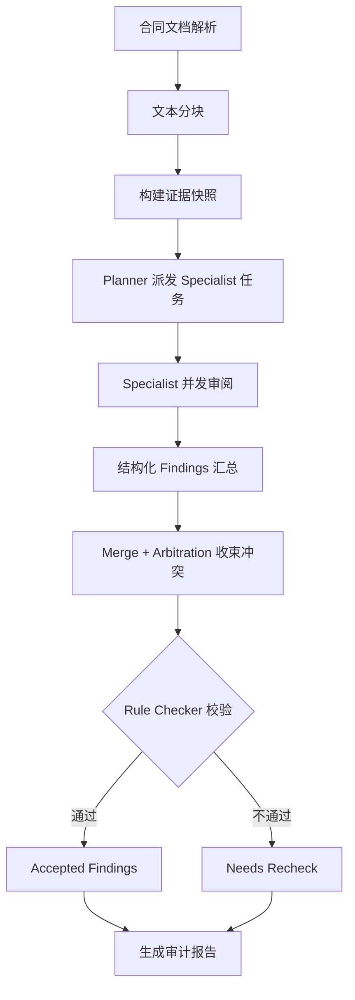
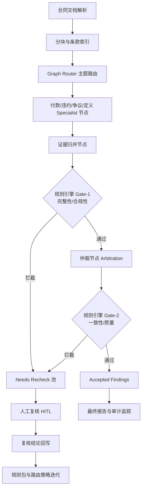

# 法律合同审阅多 Agent 改造与规则引擎完整实施方案

## 1. 目标与范围

### 1.1 目标
- 将当前项目升级为可生产化的法律合同审阅系统，达到：
- 高覆盖（召回更多真实风险）
- 高可信（每条结论有证据锚点与法条依据）
- 高一致（跨条款冲突被收束）
- 高可审计（可追溯“谁在何时、依据何规则得出何结论”）

### 1.2 范围
- 本方案覆盖：
- 多 agent 编排改造
- 规则引擎设计与实现
- 数据结构与接口扩展
- 质量评测与上线策略
- 不覆盖：
- 前端展示改版
- 非合同类文档审阅

---

## 2. 当前关键问题（基于现有代码）

### 2.1 主流程问题
- 审阅强度参数未透传，主流程固定用“标准”强度，影响审阅深度。
- 分块异常处理存在静默降级，容易出现“假低风险”。

### 2.2 多 Agent 问题
- `hierarchical` 架构覆盖能力强，但 merge 去重不够，输出冗长。
- `checker` 当前门槛偏松，拦截能力不足（需要强化硬性校验规则）。
- `merge_arbitration` 有较好收束能力，但存在占位文本混入最终结果风险。

### 2.3 输出与可审计问题
- 风险等级字段规范不统一（例如“中；评分60”混写），不利于排序和统计。
- 关键审计字段（如法条依据、证据定位、规则命中）没有完整落库。

### 2.4 安全与合规问题
- 配置层存在敏感信息硬编码风险。
- 缺少“规则版本 + 模型版本 + 证据版本”联合追溯链。

---

## 3. 推荐目标架构（最佳实践）

## 3.1 总体链路（三段式）
1. `Planner + Specialist`（覆盖层）
2. `Merge + Arbitration`（收束层）
3. `Rule Checker + Legal Gate`（质检层）

链路：

`文档解析 -> 分块 -> 证据快照 -> 派发 specialist -> 结构化发现 -> 全局归并仲裁 -> 规则引擎校验 -> 输出 accepted / needs_recheck`

### 3.2 角色定义
- Planner：任务规划、specialist 派单、执行编排。
- Specialist：按领域输出结构化发现（付款、违约、争议、生效、定义等）。
- Arbitrator：解决冲突、去重、统一跨条款口径。
- Rule Checker：执行硬规则，打回不合格结论。
- Reporter：生成审计报告、复核清单。

### 3.3 输出分层
- `Accepted Findings`：证据充分、规则通过、可直接展示给用户。
- `Needs Recheck`：证据弱、规则触发告警、需人工复核。
- `Suppressed Findings`：重复、冲突后被撤销、或低置信度剔除。

### 3.4 新增方式：Workflow Graph 混合主线（推荐升级版）
- 方式定义：`Workflow Graph + Router + Rule Engine + Arbitration + HITL`。
- 适用场景：生产上线、强审计、强可控、需要人工复核闭环的法律合同审阅。
- 关键特征：
- 节点化编排：每个阶段是显式节点，可追踪、可回放。
- 路由化分派：Router 按条款主题将分块发送给最合适 specialist。
- 双重门禁：先规则引擎硬校验，再仲裁收束。
- 人工闭环：`needs_recheck` 自动进入人工复核池并回流训练规则。

### 3.5 两种方式定位与取舍
- 方式A（三段式）：`Planner/Specialist -> Merge/Arbitration -> Rule Checker`。
- 优点：实现成本低，能快速从当前代码演进。
- 风险：编排弹性与可观测性不如图编排。
- 方式B（Workflow Graph 混合主线）：`Graph + Router + Rule Gate + HITL`。
- 优点：可观测性、可审计性、可灰度能力更强，更适合线上长期迭代。
- 风险：工程复杂度与初期建设成本更高。

### 3.6 两种方式流程图

#### 3.6.1 方式A：三段式（当前推荐基线）



#### 3.6.2 方式B：Workflow Graph 混合主线（升级版）



---

## 4. 完整规则引擎设计

## 4.1 设计原则
- 规则优先于自然语言结论：模型结论必须经过规则门禁。
- 结构化优先：规则引擎只吃结构化输入，不直接解析大段自由文本。
- 可配置、可版本化、可灰度：规则可热更新，可按合同类型启停。

### 4.2 规则类型
- 完整性规则（必填字段、证据字段、引用字段）
- 一致性规则（跨块字段一致、附件回指一致）
- 合规性规则（法律来源有效性、地区适配）
- 风险规则（风险分级阈值、重大风险升级）
- 质量规则（占位词、空泛建议、模板化输出拦截）
- 冲突规则（同主题冲突建议合并与优先级）

### 4.3 规则执行优先级
- `BLOCKER`：阻断，进入 `needs_recheck`
- `MAJOR`：允许输出但标记高优先复核
- `MINOR`：提示性告警，不阻断

执行顺序：
1. 完整性
2. 合规性
3. 一致性
4. 质量
5. 风险映射与重打分

### 4.4 规则 DSL（建议用 YAML）

```yaml
rule_id: RISK-HIGH-EVIDENCE-001
version: 1.0.0
enabled: true
priority: BLOCKER
scope:
  contract_types: ["通用", "基建类合同", "服务类合同", "货物类合同"]
  stages: ["checker"]
condition:
  all:
    - field: risk_level
      op: eq
      value: "高"
    - any:
      - field: evidence
        op: is_empty
      - field: evidence_chunk_ids
        op: size_eq
        value: 0
action:
  decision: needs_recheck
  tags: ["证据不足", "高风险缺锚点"]
  message: "高风险结论必须提供证据摘要和证据分块锚点"
```

### 4.5 规则引擎输入数据契约

```json
{
  "finding_id": "chunk-12-payment-finding-1",
  "title": "预付款触发条件不明确",
  "risk_level": "高",
  "risk_score": 86,
  "issue": "...",
  "suggestion": "...",
  "evidence": "...",
  "evidence_chunk_ids": ["chunk-12"],
  "dependency_ids": ["chunk-11", "definition-3"],
  "law_basis": [
    {"source_id": "law-509", "title": "民法典", "article_no": "第五百零九条"}
  ],
  "rule_hits": [],
  "metadata": {
    "contract_type": "基建类合同",
    "stance": "甲方",
    "specialist": "付款与结算 specialist",
    "model_name": "xxx"
  }
}
```

### 4.6 规则引擎输出数据契约

```json
{
  "finding_id": "chunk-12-payment-finding-1",
  "checker_status": "accepted",
  "severity": "PASS",
  "rule_hits": [
    {
      "rule_id": "RISK-HIGH-EVIDENCE-001",
      "priority": "BLOCKER",
      "result": "PASS",
      "message": "证据锚点齐全"
    }
  ],
  "checker_notes": []
}
```

### 4.7 冲突仲裁规则（核心）
- 同主题冲突：保留风险等级高 + 证据更具体 + 法条更明确的一条为主。
- 字段冲突：生成“全局统一建议”，撤销局部互斥建议。
- 版本冲突：新规则版本仅影响新任务，历史结果保留原版本解释。

### 4.8 法律合同场景建议内置规则集（首批）

#### A. 证据与法条类
- 高风险结论必须有 `evidence + evidence_chunk_ids`。
- 高风险结论必须至少有一条 `law_basis` 或内部强规则依据。
- 引用法条需校验有效性状态（有效/失效）。

#### B. 条款完整性类
- 生效条款不得留空（日期、条件、签署信息）。
- 争议解决条款不得缺“方式+地点/机构”。
- 付款条款不得缺“触发条件+期限+支付方式”。

#### C. 一致性类
- 违约金比例跨条款一致性校验。
- 付款期限跨条款一致性校验。
- 附件与正文引用编号一致性校验。

#### D. 风险校准类
- 占位输出（如“修改建议”“本块原文中的问题”）直接判为 `needs_recheck`。
- “无修改建议”且 `risk_level=高/中` 视为矛盾，直接打回。

---

## 5. 代码落地方案（按模块）

## 5.1 新增目录建议

```text
app/services/rule_engine/
  __init__.py
  schema.py                 # 规则与结果数据模型
  loader.py                 # YAML/JSON 规则加载与版本管理
  operators.py              # eq/in/regex/size/empty 等操作符
  evaluator.py              # 规则执行器
  resolver.py               # 冲突优先级与结果决策
  builtin_rules/
    integrity.yaml
    consistency.yaml
    legal_compliance.yaml
    quality.yaml
```

### 5.2 与多 agent 集成点
- 在 `hierarchical_evidence_checker_demo.py` 的 `_run_checker` 中替换为 `RuleEngineEvaluator`。
- 在 `merge_arbitration_demo.py` 输出 final_issues 前增加规则后置校验，过滤占位内容。
- 在主流程 `review_task.py` 增加“规则校验摘要”SSE事件（不改变原事件结构，可新增扩展字段）。

### 5.3 数据库扩展建议

新增表：
- `review_finding`：结构化发现主表
- `review_rule_hit`：规则命中明细
- `review_trace`：阶段执行轨迹（planner/specialist/arbitration/checker）

关键字段建议：
- `rule_version`
- `model_name`
- `snapshot_id`
- `checker_status`
- `needs_recheck_reason`

### 5.4 配置扩展建议

在 `app/rag/config.py` 或新增 `app/services/rule_engine/config.py`：
- `rule_engine.enabled`
- `rule_engine.rule_pack`
- `rule_engine.fail_closed`（规则引擎不可用时是否阻断）
- `rule_engine.blocker_threshold`

---

## 6. 实施阶段与里程碑

## 6.1 Phase 0（1-2 天，立刻见效）
- 修复强度参数透传。
- 风险等级字段标准化拆分：`risk_level` 与 `risk_score`。
- 占位词拦截（至少在 checker 层拦截）。
- 清理硬编码密钥，改为环境变量。

产出：
- 主流程结果稳定性明显提升。

### 6.2 Phase 1（3-5 天，结构升级）
- 建立规则引擎基础框架（加载、执行、命中记录）。
- 将 `hierarchical` checker 接入规则引擎。
- 打通 `accepted / needs_recheck` 双通道输出。

产出：
- checker 从“软校验”升级为“硬门禁”。

### 6.3 Phase 2（5-7 天，法律能力增强）
- 上线首批法律规则包（完整性、一致性、合规性）。
- 增加法条有效性过滤和地区适配。
- 增加跨条款一致性专用 specialist/validator。

产出：
- 法律可用性显著提升。

### 6.4 Phase 3（持续迭代）
- 建立人工复核反馈闭环。
- 规则灰度发布和A/B评测。
- 自动生成规则命中报表。

---

## 7. 质量评测体系（必须落地）

## 7.1 核心指标
- 召回率：高风险条款是否被发现。
- 证据有效率：高风险结论中证据锚点完整比例。
- 一致性通过率：关键字段冲突被正确收束比例。
- 复核压力：`needs_recheck` 占比与人工可处理性。
- 时延：单合同总处理耗时。

### 7.2 验收门槛建议
- 高风险结论证据完整率 >= 95%
- 占位文本泄漏率 = 0
- 关键字段一致性冲突漏检率 <= 5%
- `needs_recheck` 比例控制在 10%-25%（可随场景调优）

---

## 8. 示例：规则引擎执行伪代码

```python
def run_rule_engine(finding, rules):
    hits = []
    decision = "accepted"
    notes = []

    for rule in sort_by_priority(rules):
        result = evaluate(rule.condition, finding)
        hit = build_rule_hit(rule, result)
        hits.append(hit)
        if result and rule.priority == "BLOCKER":
            decision = "needs_recheck"
            notes.append(rule.action.message)

    finding.rule_hits = hits
    finding.checker_status = decision
    finding.checker_notes = dedup(notes)
    return finding
```

---

## 9. 与现有文件的改造映射（建议）

### 9.1 主流程修复
- `app/router/review_task.py`
- 使用 `review_task.intensity` 透传，不再写死“标准”。
- chunk 失败时输出结构化错误事件并记录。

### 9.2 审阅解析规范化
- `app/services/contract_review.py`
- 从 `risk_level` 中拆分 `risk_score`。
- 解析失败策略升级：可恢复错误与不可恢复错误分级处理。

### 9.3 多 Agent 校验升级
- `app/services/multi_agent/hierarchical_evidence_checker_demo.py`
- `_run_checker` 接 rule engine。
- 增加占位文本与证据弱结论拦截。

- `app/services/multi_agent/merge_arbitration_demo.py`
- final 输出前执行质量规则与冲突后置检查。

### 9.4 规则与审计存储
- `app/models/review.py`（或新增模型文件）
- 增加规则命中明细表与执行轨迹表。

---

## 10. 风险与回滚策略

### 10.1 风险
- 规则过严导致误拦截，`needs_recheck` 激增。
- 规则包版本升级引入行为变化，影响历史可比性。

### 10.2 回滚
- 规则包支持版本切换。
- `BLOCKER` 规则支持灰度开关。
- 保留“纯模型路径”作为临时兜底，但只对内部可见。

---

## 11. 最终推荐执行顺序（可直接开工）

1. 先做 Phase 0（参数透传、字段规范、占位拦截、密钥治理）。
2. 再做 Phase 1（规则引擎骨架 + checker 接入）。
3. 然后上 Phase 2（法律规则包与一致性专检）。
4. 最后持续做 Phase 3（评测闭环与规则迭代）。

---

## 12. 交付清单模板（建议）

每次迭代交付应包含：
- 变更说明（新增规则、修改规则、影响范围）
- 规则版本号
- 指标对比（变更前/后）
- 样例合同回归结果
- 未覆盖风险与下轮计划
