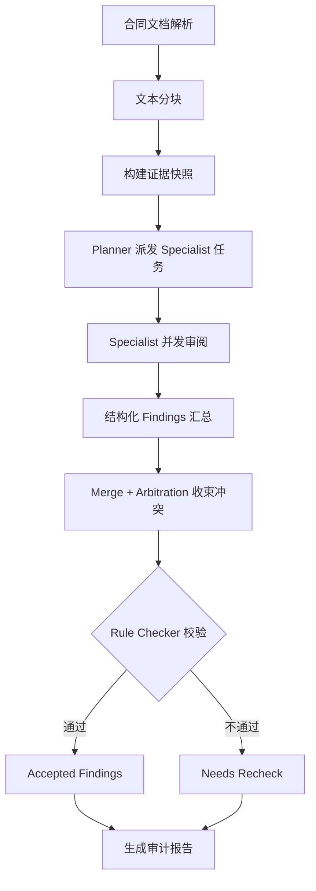

# 方案 A Demo 开发文档

## 1. 定位

- 方案来源：`MULTI_AGENT_LEGAL_REVIEW_RULE_ENGINE_PLAN.md` 中的方式 A。
- 目标：在当前 `merge_arbitration_demo` 基础上，做一个“归并仲裁 + 规则引擎后置校验”的增强版 demo。
- 当前阶段定位：仅做 demo 试运行，不接入生产主链路，不落完整数据库实现，只预留关键字段与数据契约。

一句话概括：

`构建证据快照 -> Planner 派发 Specialist 任务 -> Specialist 并发审阅 -> 结构化 Findings 汇总 -> Merge + Arbitration -> Rule Checker -> accepted / needs_recheck / 审计报告`

---

## 2. 架构链路

### 2.1 主链路

1. 合同解析
2. 文本分块
3. 构建证据快照
4. Planner 派发 Specialist 任务
5. Specialist 并发审阅
6. 结构化 Findings 汇总
7. Merge + Arbitration 全局收束
8. Rule Checker 执行硬规则
9. 输出三类结果：
- `accepted_findings`
- `needs_recheck_findings`
- `suppressed_findings`

### 2.2 必须保留的链路闭环



### 2.3 与现有 demo 的关系

- 继承对象：
- `app/services/multi_agent/review_toolkit.py`
- `app/services/multi_agent/merge_arbitration_demo.py`
- 演进方向：
- 保留当前“冲突检测 + 仲裁收束”主体能力。
- 在最终输出前增加规则引擎校验层。
- 清理占位文本、弱证据结论、风险等级字段不规范等问题。

---

## 3. demo 范围

### 3.1 本阶段要做

- 新建独立 demo 文件，不直接修改现有 `merge_arbitration_demo.py`。
- 定义规则引擎最小可用输入结构。
- 支持最小规则包加载方式，可先写死内置规则，后续再切 YAML。
- 输出中显式区分 `accepted` 与 `needs_recheck`。
- 结果文件写入 `app/services/multi_agent/result/`。

### 3.2 本阶段不做

- 不接真实数据库读写。
- 不接主审阅 API、SSE、落库链路。
- 不做完整 DSL、完整规则后台、完整灰度系统。
- 不做复杂人工复核回流。

---

## 4. 目录建议

```text
app/services/multi_agent/scheme_a_merge_rule_engine_demo/
  DEVELOPMENT_PLAN.md
  merge_rule_engine_demo.py
  schema.py
  rules.py
```

说明：

- `merge_rule_engine_demo.py`：主入口。
- `schema.py`：最小数据结构。
- `rules.py`：demo 内置规则。

---

## 5. 最小数据结构

## 5.1 EvidenceSnapshot

建议字段：

- `snapshot_id`
- `file_path`
- `file_type`
- `chunk_ids`
- `definition_records`
- `reference_tokens`
- `available_handles`

说明：

- demo 阶段不需要真实 RAG，只需要形成可供 Planner 和 Specialist 共用的证据快照。
- `available_handles` 至少要能覆盖 chunk、定义项、引用标记三类句柄。

## 5.2 SpecialistTask

建议字段：

- `task_id`
- `chunk_id`
- `specialist_name`
- `focus_area`
- `instruction`
- `context_package`
- `priority`

说明：

- `Planner` 必须先基于证据快照生成任务，再交给 specialist 并发执行。
- `context_package` 至少应包含当前 chunk、相邻窗口、相关定义、相关依赖句柄。

## 5.3 Finding

建议字段：

- `finding_id`
- `title`
- `risk_level`
- `risk_score`
- `issue`
- `suggestion`
- `evidence`
- `evidence_chunk_ids`
- `dependency_ids`
- `source_chunk_ids`
- `source_issue_ids`
- `checker_status`
- `checker_notes`
- `rule_hits`

说明：

- `risk_score` 当前仅预留，demo 阶段可为空或按简单映射生成。
- `rule_hits` 只需记录 `rule_id / result / message` 三个核心字段。

## 5.4 RuleHit

- `rule_id`
- `priority`
- `result`
- `message`

## 5.5 DemoRunSummary

- `demo_type`
- `chunk_count`
- `task_count`
- `pooled_issue_count`
- `conflict_count`
- `accepted_count`
- `needs_recheck_count`
- `suppressed_count`
- `elapsed_seconds`
- `result_file_path`

---

## 6. 规则引擎最小设计

## 6.1 执行顺序

1. 完整性规则
2. 质量规则
3. 一致性后置规则
4. 风险校准

## 6.2 首批内置规则

### A. 高风险证据完整性

- 当 `risk_level == 高` 时：
- `evidence` 不得为空
- `evidence_chunk_ids` 不得为空
- 否则进入 `needs_recheck`

### B. 占位文本拦截

若命中以下任一文本，进入 `needs_recheck`：

- `本块原文中的问题`
- `修改建议`
- `未找到修改建议`

### C. 风险等级规范

- 只允许 `高 / 中 / 低`
- 若出现 `中；评分60` 这类混写，拆分并标准化

### D. 冲突后空证据拦截

- 若仲裁后的全局问题没有有效证据摘要，进入 `needs_recheck`

---

## 7. 关键实现点

## 7.1 构建证据快照

- 在文本分块后先生成 `EvidenceSnapshot`。
- 快照至少包含：
- `chunk_id`
- 轻量定义项
- 轻量引用标记
- 可用依赖句柄集合
- 后续所有 Specialist 任务都只能读取这份快照，不直接改写共享事实层。

## 7.2 Planner 派发 Specialist 任务

- Planner 不直接给最终结论。
- Planner 负责：
- 根据 chunk 内容和标签选择 specialist
- 生成 `SpecialistTask`
- 为每个任务组装最小 `context_package`
- 若某个 chunk 命中多个主题，可派发多个 specialist 任务

## 7.3 Specialist 并发审阅

- Specialist 必须并发执行，而不是顺序串行。
- 每个 specialist 只输出结构化 findings。
- Specialist 输出不得直接修改全局结果池，只能返回自己的 task 结果。

## 7.4 结构化 Findings 汇总

- 并发 specialist 完成后，必须先经过统一汇总层。
- 汇总层负责：
- 按 task_id 收集 findings
- 清洗空输出
- 标记来源 specialist、来源 chunk、依赖句柄
- 形成进入 Merge 的标准化 finding 池

## 7.5 复用当前归并能力

- 继续使用当前 demo 的：
- chunk 并发分析
- 字段冲突检测
- 建议冲突检测
- 跨块联动冲突检测
- 仲裁收束逻辑

## 7.6 Merge + Arbitration 收束冲突

- `E -> F -> G` 这一段必须显式存在：
- `E`：并发 specialist 输出
- `F`：结构化 Findings 汇总
- `G`：Merge + Arbitration 收束冲突
- Merge 负责去重、主题聚合、证据合并。
- Arbitration 负责解决冲突、保留主版本、撤销弱版本。

## 7.7 新增 checker 层

- 将当前 `final_issues` 转为统一 `Finding` 结构。
- 对每条 finding 执行规则。
- 根据规则结果输出：
- `accepted`
- `needs_recheck`
- `suppressed`

## 7.8 checker 分流逻辑

- `G -> H -> I/J -> K` 这一段必须写实，不只是概念描述。
- `Rule Checker` 至少做以下判断：

### 通过进入 Accepted Findings

- 风险等级字段合法
- 高风险 finding 具备 `evidence + evidence_chunk_ids`
- 未命中占位文本规则
- 依赖句柄可解析
- 仲裁后未被标记为重复或撤销

### 不通过进入 Needs Recheck

- 命中占位文本
- 高风险无证据
- evidence_chunk_ids 缺失
- 依赖句柄不可解析
- 冲突收束后仍存在模糊建议或空泛结论

### Accepted 与 Needs Recheck 最终都进入审计报告

- `Accepted Findings`：作为主要结果展示
- `Needs Recheck`：作为复核池附录展示
- `生成审计报告` 时必须写明：
- 总耗时
- 任务数
- accepted 数量
- needs_recheck 数量
- suppressed 数量
- 规则命中摘要

## 7.9 结果文件格式

建议输出：

1. 运行摘要
2. 规则命中统计
3. Accepted Findings
4. Needs Recheck Findings
5. Suppressed Findings
6. 审计摘要

---

## 8. 数据库与表结构预留

当前不做真实表创建，只在 demo 文档中约定关键字段。

## 8.1 review_finding（预留）

- `id`
- `review_id`
- `finding_id`
- `title`
- `risk_level`
- `risk_score`
- `checker_status`
- `snapshot_id`
- `model_name`
- `rule_version`
- `created_at`

## 8.2 review_rule_hit（预留）

- `id`
- `finding_id`
- `rule_id`
- `priority`
- `result`
- `message`
- `created_at`

## 8.3 review_trace（预留）

- `id`
- `review_id`
- `stage_name`
- `status`
- `elapsed_ms`
- `payload_summary`
- `created_at`

说明：

- demo 阶段只需在内存对象和结果 JSON 中保留这些字段。
- 后续若接数据库，优先保证字段名不大改。

---

## 9. 开发步骤

### Phase A1

- 从 `merge_arbitration_demo.py` 拷贝一份独立 demo 骨架。
- 抽出统一 `Finding` 数据结构。

### Phase A2

- 加入最小规则执行器。
- 增加 `accepted / needs_recheck / suppressed` 三路输出。

### Phase A3

- 增加结果文本与 JSON 文件落盘。
- 补本地 fake model 自测。

### Phase A4

- 用真实合同做一次回归运行。
- 对比当前 `merge_arbitration_demo` 的输出质量与运行时间。

---

## 10. 验证要求

### 10.1 本地结构验证

- fake model 下可完整跑通。
- 占位文本能被拦截到 `needs_recheck`。
- 高风险无证据结论能被拦截。

### 10.2 真实运行验证

- 可用 `data/` 下真实合同执行。
- 结果文件中必须写明总耗时、accepted 数量、needs_recheck 数量。

---

## 11. 风险点

- 规则过严会导致 `needs_recheck` 激增。
- 规则过松则与当前 demo 差异不明显。
- 若仲裁结果本身证据过于模板化，checker 只能拦截，无法自动补强。

---

## 12. 当前阶段结论

- 方案 A 适合作为当前 multi_agent demo 的近期主线。
- 相比现有 `merge_arbitration_demo`，它最关键的升级点不是更多 agent，而是“归并后强校验”。
- 该方案实现成本低、结果更容易收束，适合先做成可稳定比较的增强版 demo。
