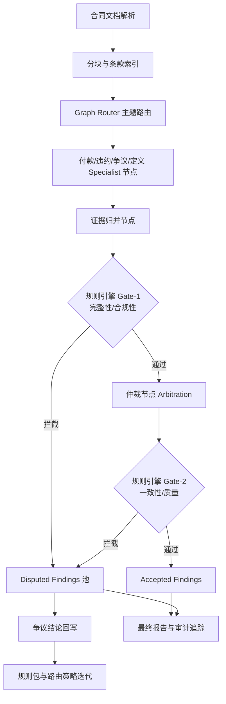

# 方案 B Demo 开发文档

## 1. 定位

- 方案来源：`MULTI_AGENT_LEGAL_REVIEW_RULE_ENGINE_PLAN.md` 中的方式 B。
- 目标：设计一个直接基于 LangGraph 实现的图式工作流 demo，用节点化方式表达合同审阅多 agent 链路。
- 当前阶段定位：仅做 demo 试运行文档设计，直接使用 LangGraph 编排，不实现完整生产级图，不接真实数据库，只预留关键字段。

一句话概括：

`LangGraph 图编排 -> Router 主题路由 -> Specialist 节点并行 -> 证据归并 -> Gate-1 -> Arbitration -> Gate-2 -> Accepted / Disputed Pool -> 最终报告与审计追踪`

---

## 2. 架构链路

## 2.1 Graph 节点链路

当前 demo 采用如下主链路：



建议节点顺序：

1. `parse_document`
2. `split_and_index`
3. `router`
4. `specialist_payment`
5. `specialist_liability`
6. `specialist_dispute`
7. `specialist_definition`
8. `merge_evidence`
9. `rule_gate_1`
10. `arbitration`
11. `rule_gate_2`
12. `record_disputed_findings`
13. `reporter`

说明：

- 本方案 demo 明确直接使用 LangGraph。
- 不再设计人工确认节点。
- 任何被 Gate-1 或 Gate-2 拦截的结论，统一进入 `disputed_findings`，后续直接记录与回写，不要求人工点选确认。

## 2.2 路由逻辑

- `router` 不直接做最终判断。
- 只负责按条款主题或规则标签，将 chunk 发送到一个或多个 specialist 节点。
- 节点输出统一写入图状态，不允许自由文本乱写共享状态。
- `router` 在 demo 阶段仍采用确定性规则，不依赖额外 LLM Router。
- LangGraph 只负责状态流转、分支和汇聚；主题命中仍由规则控制。

## 2.3 双 Gate 设计

### Gate-1

- 检查完整性、占位词、证据字段是否齐全。
- 不合格直接打入 `disputed_findings`。

### Gate-2

- 在仲裁后执行一致性、冲突收束、质量规则。
- 只允许最终可展示结果进入 `accepted_findings`。
- 不通过的结果同样进入 `disputed_findings`。

### Disputed Findings 池

- 用于统一收纳所有争议性结论，而不是等待人工点击确认。
- 记录内容至少包括：
- 被哪个 Gate 拦截
- 命中了哪些规则
- 来源 specialist / task / chunk
- 原始结论与当前状态
- 可选回写标签

当前口径：

- `disputed_findings` 只保留一个结果区。
- 通过字段 `gate_name` 区分来自 `Gate-1` 还是 `Gate-2`。

### 回写逻辑

- demo 阶段不做人审操作。
- `record_disputed_findings` 节点只负责把争议结论结构化记录到结果对象中。
- `规则包与路由策略迭代` 在 demo 阶段仅表现为：
- 生成本轮争议统计
- 输出高频失败规则
- 输出高频误路由主题
- 供后续人工离线调参

---

## 3. demo 范围

### 3.1 本阶段要做

- 设计基于 LangGraph 的图式状态对象。
- 明确节点输入输出。
- 明确路由规则和分支收束点。
- 明确 Gate-1 / Arbitration / Gate-2 / disputed pool 的状态流转。
- 预留结果记录与争议回写字段。

### 3.2 本阶段不做

- 不做完整状态持久化。
- 不做人工复核界面。
- 不做人工确认动作。
- 不做真正的数据库事务回放。
- 不做完整规则 DSL 管理后台。

---

## 4. 目录建议

```text
app/services/multi_agent/scheme_b_langgraph_workflow_demo/
  DEVELOPMENT_PLAN.md
  graph_demo.py
  graph_state.py
  node_handlers.py
  router_rules.py
  gate_rules.py
```

说明：

- `graph_demo.py`：主入口。
- `graph_state.py`：图状态定义。
- `node_handlers.py`：节点处理逻辑。
- `router_rules.py`：主题路由和节点选择规则。
- `gate_rules.py`：Gate-1 / Gate-2 的规则校验逻辑。

说明：

- `gate_rules.py` 在方案 B 中独立维护。
- 不直接复用方案 A 的 checker 文件。
- 可以参考 A 的规则思路，但代码和规则组织独立。

---

## 5. 图状态设计

## 5.1 GraphState

关键字段建议：

- `run_id`
- `snapshot_id`
- `file_path`
- `file_type`
- `chunks`
- `chunk_index_map`
- `evidence_snapshot`
- `rag_context_refs`
- `router_tasks`
- `specialist_outputs`
- `merged_findings`
- `accepted_findings`
- `disputed_findings`
- `suppressed_findings`
- `gate1_findings`
- `gate2_findings`
- `execution_trace`
- `routing_summary`
- `rule_summary`
- `elapsed_seconds`

## 5.2 RouterTask

- `task_id`
- `chunk_id`
- `route_topics`
- `target_specialists`
- `priority`
- `context_handles`
- `rag_query_keys`
- `route_reasons`

## 5.3 SpecialistOutput

- `task_id`
- `specialist_name`
- `findings`
- `raw_output`
- `status`
- `chunk_id`
- `route_topic`

## 5.4 ExecutionTrace

- `trace_id`
- `node_name`
- `status`
- `started_at`
- `ended_at`
- `elapsed_ms`
- `summary`
- `input_count`
- `output_count`

## 5.5 DisputedFinding

- `finding_id`
- `stage_name`
- `gate_name`
- `rule_hits`
- `risk_level`
- `title`
- `issue`
- `suggestion`
- `evidence`
- `source_task_ids`
- `source_chunk_ids`
- `dispute_reason`
- `dispute_tags`

---

## 6. 节点职责定义

## 6.1 parse_document

- 解析合同文件。
- 输出基础文本。

## 6.2 split_and_index

- 按现有 toolkit 分块。
- 同时生成稳定 `chunk_id` 和简单主题标签。

## 6.3 build_snapshot

- 构建共享证据快照。
- 抽定义项、引用标记、附件标识。

说明：

- 本方案主链路图中可以不单独暴露 `build_snapshot` 节点。
- demo 可以将其内聚在 `split_and_index` 后的状态构造逻辑中。
- 如果后续需要增强审计可观测性，再拆成独立 LangGraph 节点。

## 6.4 router

- 基于关键词、条款模式和定义命中进行主题路由。
- 为后续 specialist 构造 `RouterTask`。

## 6.5 specialist 节点

- 每个 specialist 只处理自己主题。
- 只输出结构化 findings。

## 6.6 merge_evidence

- 合并多个 specialist 输出。
- 保留来源节点、来源 task、证据锚点。
- 先做证据级聚合，再做主题级合并。
- 为 Gate-1 输出统一的结构化 finding 列表。

## 6.7 rule_gate_1

- 拦截空证据、高风险弱结论、占位文本。
- 拦截后不进入人工节点，直接写入 `disputed_findings`。
- 输出：
- `gate1_pass_findings`
- `gate1_blocked_findings`

## 6.8 arbitration

- 处理冲突、重复、跨块联动。
- 输出全局统一口径。
- 仅处理通过 Gate-1 的 finding。

## 6.9 rule_gate_2

- 检查最终质量、一致性和可展示性。
- 拦截结果继续流入 `disputed_findings`。

## 6.10 record_disputed_findings

- 汇总 Gate-1 / Gate-2 拦截结果。
- 记录争议结论、规则命中、来源节点、来源任务。
- 生成可供后续调规则与调路由的统计摘要。
- 文本报告默认展示摘要和规则命中，不展示 disputed finding 全文。

## 6.11 reporter

- 输出文本结果、JSON 结果、运行轨迹摘要。
- 同时输出：
- `accepted_findings`
- `disputed_findings`
- `routing_summary`
- `rule_summary`
- `disputed_findings` 默认输出摘要和规则命中统计。

---

## 7. 最小规则与路由策略

## 7.1 首批 router 策略

- 命中 `付款/预付款/进度款/结算/验收` -> 付款 specialist
- 命中 `违约/赔偿/免责/责任/索赔` -> 责任 specialist
- 命中 `争议/仲裁/法院/通知/解除/终止` -> 争议 specialist
- 命中 `定义/系指/附件/附表/空白/留空` -> 定义 specialist

## 7.2 首批 rule gate 规则

- 高风险无证据 -> `disputed_findings`
- 占位输出 -> `disputed_findings`
- 仲裁后重复 finding -> `suppressed`
- 依赖句柄无法解析 -> `disputed_findings`
- 总结性标题混入单条 finding -> `disputed_findings`
- 修改建议为空或过于空泛 -> `disputed_findings`

---

## 8. 数据库与表结构预留

当前不做真实建表，只预留字段。

说明：

- 这里的“表结构”仅用于约束 demo 输出结构，不代表本阶段会真实建库。
- demo 阶段优先把这些字段体现在 `GraphState`、结果 JSON 和 trace 中。
- RAG 本阶段不真实接入，只预留引用字段和句柄字段。

## 8.1 workflow_run（预留）

- `id`
- `run_id`
- `graph_version`
- `rule_version`
- `model_name`
- `snapshot_id`
- `rag_enabled`
- `rag_version`
- `status`
- `elapsed_seconds`
- `created_at`

## 8.2 workflow_node_trace（预留）

- `id`
- `run_id`
- `node_name`
- `status`
- `started_at`
- `ended_at`
- `elapsed_ms`
- `summary`

## 8.3 workflow_finding（预留）

- `id`
- `run_id`
- `finding_id`
- `checker_status`
- `risk_level`
- `gate_name`
- `source_node`
- `source_task_id`
- `snapshot_id`
- `rag_refs_json`
- `created_at`

说明：

- `checker_status` 在方案 B 中建议限定为：
- `accepted`
- `disputed`
- `suppressed`

## 8.4 workflow_disputed_finding（预留）

- `id`
- `run_id`
- `finding_id`
- `gate_name`
- `dispute_reason`
- `rule_hits_json`
- `source_node`
- `source_task_ids`
- `source_chunk_ids`
- `snapshot_id`
- `rag_refs_json`
- `created_at`

## 8.5 workflow_rule_hit（预留）

- `id`
- `finding_id`
- `rule_id`
- `gate_name`
- `result`
- `message`
- `created_at`

## 8.6 workflow_router_trace（预留）

- `id`
- `run_id`
- `task_id`
- `chunk_id`
- `route_topics`
- `target_specialists`
- `route_reasons`
- `rag_query_keys`
- `created_at`

---

## 9. demo 实现约束

- 必须直接使用 LangGraph 实现图结构，不再采用“先用普通函数模拟图”的过渡方案。
- 允许将 Router、Gate、Arbitration 逻辑做成确定性节点，不强制它们依赖模型。
- Specialist 节点允许复用现有 `multi_agent` 下的 `toolkit` 与 `config`。
- 结果输出必须同时包含：
- `accepted_findings`
- `disputed_findings`
- `suppressed_findings`
- `execution_trace`
- `routing_summary`
- `rule_summary`
- `disputed_findings` 在报告中默认只展示摘要和规则命中。
- demo 阶段数据库相关内容只保留字段设计，不做真实 ORM、DDL、迁移脚本。
- demo 阶段 RAG 只保留：
- `rag_context_refs`
- `rag_query_keys`
- `rag_refs_json`
- 不做真实向量索引、召回服务和重排链路。

## 10. 分步开发

### Phase B1：最小 LangGraph 骨架

- 直接使用 LangGraph 建图，不再走“函数节点模拟图”的过渡方案。
- 先打通最小节点链路：
- `parse_document`
- `split_and_index`
- `router`
- `specialist_*`
- `merge_evidence`
- `rule_gate_1`
- `arbitration`
- `rule_gate_2`
- `record_disputed_findings`
- `reporter`
- 先确保图能串起来，状态能在节点之间稳定传递。

输出要求：

- 能产出最小 `GraphState`
- 能落 `txt/json`
- 能看到基本 `execution_trace`

### Phase B2：状态对象与结果结构固化

- 抽出 `GraphState / RouterTask / SpecialistOutput / DisputedFinding / ExecutionTrace`
- 统一每个节点的输入输出字段
- 统一 `accepted / disputed / suppressed` 三路结果结构
- 把数据库预留字段先体现在结果 JSON 中，不做真实数据库实现
- 把 RAG 预留字段先体现在状态对象和结果结构中，不接真实 RAG

输出要求：

- 结果 JSON 中有稳定字段
- 节点 trace 可回放
- disputed finding 能看到 `gate_name / rule_hits / source_task_ids`

### Phase B3：Router 与 Specialist 并行链路

- 实现 Graph Router 的主题路由规则
- 接入 4 类 specialist 节点：
- `付款`
- `责任/违约`
- `争议`
- `定义/异常`
- specialist 节点并发执行
- `merge_evidence` 负责收束多节点输出

输出要求：

- 能统计 `router_tasks`
- 能统计各 specialist 任务分布
- 能输出 `merged_findings`

### Phase B4：双 Gate + Arbitration

- 实现 `rule_gate_1`
- 实现 `arbitration`
- 实现 `rule_gate_2`
- 将 Gate-1 / Gate-2 拦截结果统一写入 `disputed_findings`
- reporter 同时输出 accepted 和 disputed

输出要求：

- 能区分 Gate-1 和 Gate-2 的拦截来源
- 能输出规则命中统计
- 能输出仲裁决策摘要

### Phase B5：真实合同回归与文档化

- 使用真实合同跑 LangGraph demo
- 输出总耗时和节点耗时
- 输出 routing summary 和 rule summary
- 记录高频 disputed 原因
- 补充开发进度文档和已知问题

输出要求：

- `txt` 中能看到节点耗时
- `json` 中能看到完整 trace
- 能根据结果判断 Router / Gate 是否需要继续调参

### Phase B6：预留增强项

- 仅预留，不在本阶段实现：
- 真实数据库落表
- 规则 DSL
- 真实 RAG 检索
- 人工复核界面
- LangGraph 持久化与回放能力增强

---

## 11. 验证要求

### 11.1 本地结构验证

- 假模型下所有节点能完整走通。
- `execution_trace` 中能看到每个节点的开始、结束和状态。
- `disputed_findings` 能正确记录 Gate-1 / Gate-2 拦截来源。

### 11.2 真实运行验证

- 真实合同下能输出：
- `accepted_findings`
- `disputed_findings`
- 节点执行轨迹
- 总耗时
- 路由统计
- 规则统计

---

## 12. 风险点

- 直接使用 LangGraph 会提高起步复杂度，但这是本方案必须接受的约束。
- Graph 节点过细会增加理解成本和调试成本。
- 若 Router 粒度过粗，会导致 specialist 分发失衡；过细则会导致任务爆炸。
- 如果过早把数据库、RAG、规则 DSL 都做实，会明显拖慢 demo 节奏。

---

## 13. 当前阶段结论

- 方案 B 更适合作为中长期主线，而不是当前最先落地的默认 demo。
- 它最大的价值不是立即提升结论质量，而是提供更强的编排透明度、节点追踪能力和规则/路由迭代接口。
- 当前 demo 阶段应坚持：
- 直接使用 LangGraph
- 弱化数据库实现
- RAG 仅保留字段
- 先把图跑通，再逐步增强规则、路由和追踪能力

## 14. 当前实现口径

- `disputed_findings` 只保留一个结果区，使用 `gate_name` 标识来源 Gate。
- `gate_rules.py` 在方案 B 中独立维护，不直接复用方案 A 的 checker 实现。
- `disputed_findings` 在文本报告中默认展示摘要和规则命中，不展示全文。
